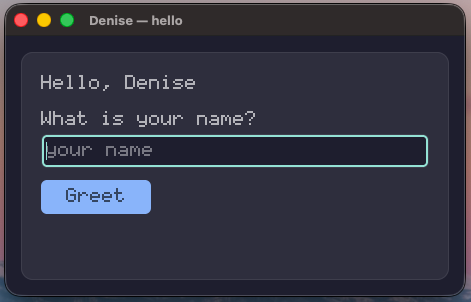
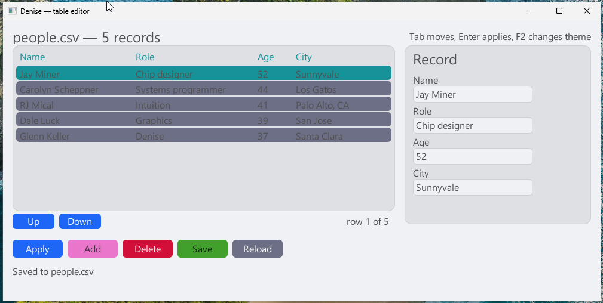
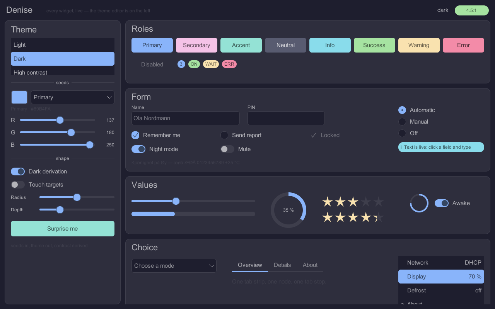
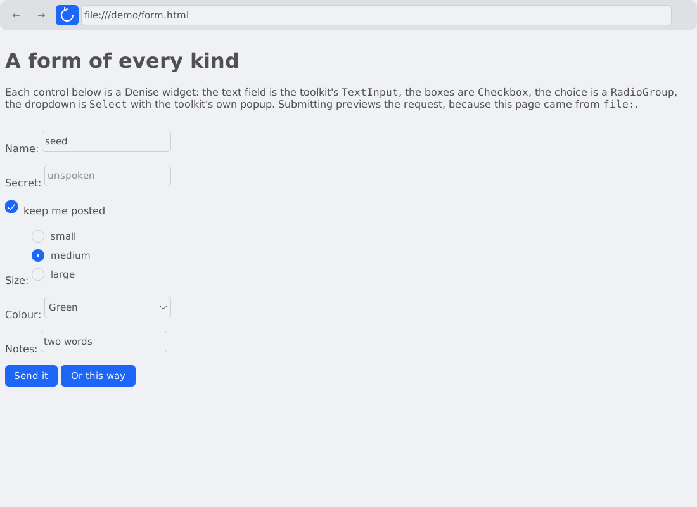
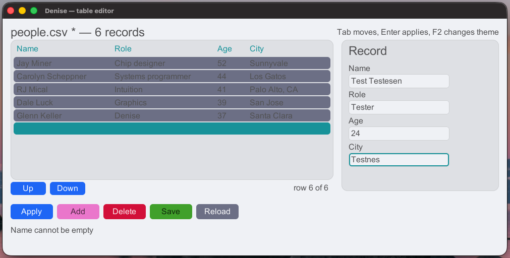
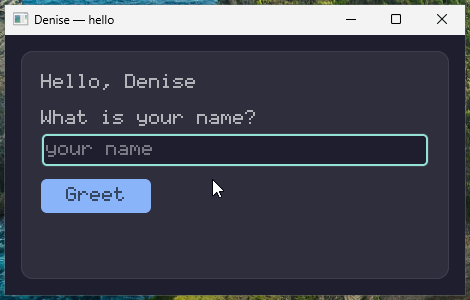
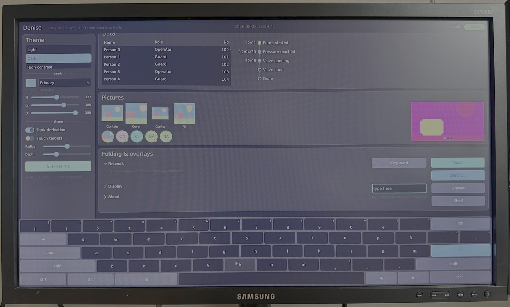
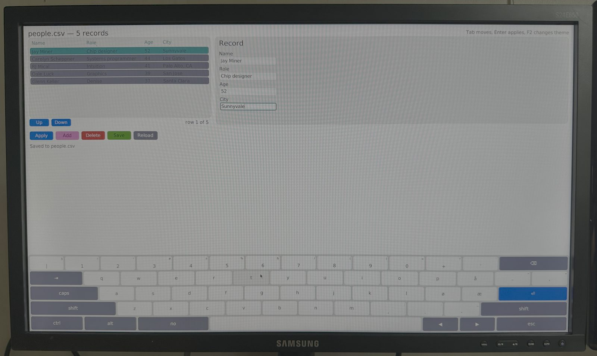
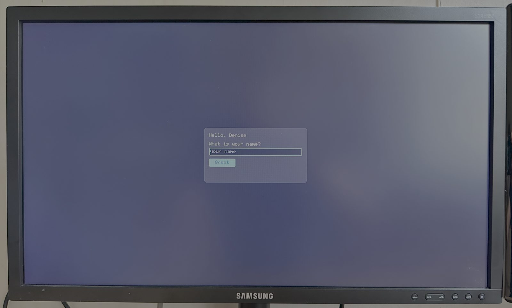
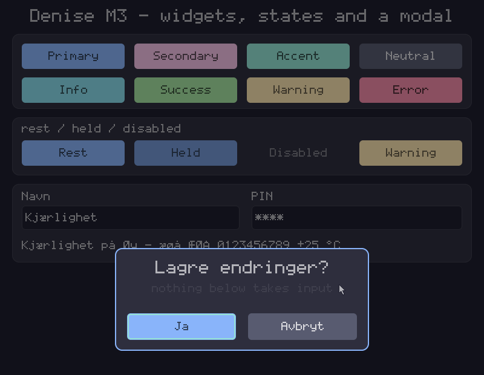

<div align="center">


# Denise

**A direct-rendering UI toolkit in Rust, for embedded Linux and systems without a
desktop environment.**

[](https://github.com/bisand/denise/actions/workflows/ci.yml)
[](https://crates.io/crates/denise)
[](https://docs.rs/denise)
[](LICENSE)
[](#constraints)
[](#status)
[-A6E3A1)](#constraints)
[](#constraints)

</div>

Kiosks, digital signage, industrial HMIs, Raspberry Pi panels, in-vehicle displays.

No X11. No Wayland. No browser engine. No managed runtime. One static binary that
opens the display, draws, and reads input.

```toml
[dependencies]
denise = "0.16"
denise-ui = "0.16"
denise-winit = "0.16"    # develop on a desktop
# denise-drm = "0.16"    # ship on a display with no compositor
# denise-image = "0.16"  # decode PNG, JPEG, GIF and BMP
```

## Show me the code

```rust
use denise::{Rect, Role, Size, theme};
use denise_ui::widgets::{Button, Label, TextInput};
use denise_ui::Ui;

#[derive(Clone, Copy, PartialEq, Eq)]
enum Message {
    Greet,
}

let mut ui: Ui<Message> = Ui::new(Size::new(460, 260), theme::DARK);
let root = ui.root();

ui.add(root, Label::new("What is your name?"), Rect::new(20, 20, 388, 20));
let name = ui.add(root, TextInput::<Message>::new(), Rect::new(20, 44, 388, 34)).unwrap();
ui.add(
    root,
    Button::new("Greet", Message::Greet).with_role(Role::Primary),
    Rect::new(20, 90, 110, 34),
);
```

Widgets do not run callbacks. A button holds a value of *your* type and emits it
when pressed, so every state change happens in one `match` you wrote rather than
in a closure somewhere else:

```rust
for message in ui.drain_messages().collect::<Vec<_>>() {
    match message {
        Message::Greet => { /* read the field, update a label */ }
    }
}
```

There are no dirty flags, no `invalidate()` calls and no repaint bookkeeping
anywhere in that. Type into the field and the toolkit repaints the field, not the
window. That is the one thing this library is really about, and the way you use it
is by not doing anything.

The whole runnable version is [`examples/hello`](examples/hello/src/main.rs) —
eighty lines, half of them comments.

```bash
cargo run -p hello                                          # a window
cargo run -p hello --no-default-features --features kiosk   # the display itself
```



## A real one

[`examples/table-editor`](examples/table-editor) is the same idea grown up: a
scrolling grid, an edit form, validation, a confirmation modal, CSV persistence
and a real font.

```bash
cargo run -p table-editor                                          # a window
cargo run -p table-editor --no-default-features --features kiosk   # the display itself
cargo run -p table-editor -- --font /usr/share/fonts/truetype/dejavu/DejaVuSans.ttf
```

The same application, both times. `app.rs` — the tree, the widgets, all 470 lines
of it — never learns which; only `main.rs` differs, and only by about fifty lines
per backend.

**The choice is the application's, and it is made at compile time.** The toolkit
does not choose and offers no way to, because it cannot:
`aarch64-unknown-linux-gnu` is the same target on a kiosk Pi and on a Pi running
the desktop image, so a probe in a library would be wrong half the time — and wrong
means a binary that opens nothing on a machine somebody has already shipped. A
cargo feature settles it, which also means the kiosk build never compiles winit at
all.



Three things it is showing, none of which is obvious from the outside:

- **There was no grid widget when this example was written** — and it remains a
  lesson in how the widgets compose. There are twenty-five now, `Table` among
  them: label, button, panel, text field, checkbox, toggle, radio group, progress
  bar, slider, divider, badge, alert, tabs, list, radial progress, spinner,
  select, image, rating, avatar, table, timeline, carousel, collapse, video. A row is a full-width `Button` with the cell `Label`s placed on top of it;
  labels are not interactive, so a click falls through them to the button
  underneath and arrives as `Select(index)`. That is how most of the widgets you
  will miss get assembled.
- **Nine row nodes exist, however many records there are.** Scrolling changes what
  they display. Rebuilding the tree per frame would be easier to write and would
  throw away focus and the caret every time anybody typed.
- **The rules live away from the drawing.**
  [`table.rs`](examples/table-editor/src/table.rs) knows no widget exists — what a
  valid row is, what to select after a delete, whether re-selecting a row counts
  as an edit — and every rule in it is unit tested without a display.
- **The form gets out of the keyboard's way, by shrinking.** Tapping a field on a
  panel brings the on-screen keyboard up over the lower two thirds of the screen,
  and this form is too tall to fit above it at any offset — so it is cut to what
  is left, which makes it a viewport with more content than room, and the tree
  scrolls the focused row into view the way it scrolls anything else. Moving the
  panel would have been the obvious answer and does not arithmetically work.

`--font` loads any TrueType or OpenType file. Without one it falls back to the
built-in 8×8 bitmap font and says so, which is the tiered font story
[`denise-text`](denise-text/src/lib.rs) documents, demonstrated rather than
asserted.

## The gallery

[`examples/gallery`](examples/gallery) is every widget live on one screen, with
a theme editor beside them — nine seed colours, a light/dark switch, radius and
depth, and a Surprise button. Move a slider and the whole surface follows,
because widgets name theme *roles*, never colours; the editor just rebuilds the
theme and hands it to `Ui::set_theme`. The badge in the corner is the worst
surface/content contrast in whatever you have built, and keeping it green is
not your job: the derivation aims at WCAG AA by construction.

```bash
cargo run -p gallery                                          # a window
cargo run -p gallery -- --keyboard                            # with the keyboard up
cargo run -p gallery --no-default-features --features kiosk   # the display itself
```

Its overlays section is where the three kinds are compared side by side: a
modal takes the focus, a drawer dims what is behind it, and a **shelf** does
neither — which is what lets the on-screen keyboard type into the field above
it without the field ever losing its caret. Both shelves share the one bottom
edge, so either closes the other; that is the demonstration, not a limitation
being hidden.



## The browser

[`examples/browser`](examples/browser) is the composability proof: a small
web browser in which every visible thing is a Denise widget. Real pages —
Hacker News, Wikipedia, DuckDuckGo Lite — fetched over rustls, parsed with
html5ever, laid out by the example's own block-and-inline engine, and drawn
entirely through the toolkit: page text through the shared text engine,
images through `denise-image`, and a form's controls as the actual
`TextInput`, `Checkbox`, `RadioGroup` and `Select`, submitting for real.
No JavaScript, on purpose. The same binary drives a window or a bare panel.

```bash
cargo run -p browser -- https://news.ycombinator.com
cargo run -p browser -- --keyboard                            # with the keyboard up
cargo run -p browser --no-default-features --features kiosk   # the display itself
```

A panel has no keyboard plugged into it, so tapping the URL bar brings one up:
`denise-keyboard` follows the focus, types what evdev would have typed, and does
it in the layout the machine is configured for.



## What it costs when nothing happens

The number that matters for a panel that runs for a year. On a Raspberry Pi 3 A+
at 1920×1080, the `panel` demo left untouched for ten seconds — with a text field
focused, so its caret is blinking — draws **20 frames**, wakes **20 times**, and
spends **80 ms of CPU in total**, most of that on the two full repaints every
double-buffered swapchain owes at startup.

It blocks in `poll` on the input descriptors and the caret deadline rather than
spinning. With nothing focused there is no deadline either, and it blocks
indefinitely. Move the pointer and it repaints two cursor-sized rectangles, not a
megapixel.

## Where it runs

| | Backend | Status |
|---|---|---|
| Bare Linux, DRM/KMS | `denise-drm` | ✅ Pi 3 A+ at 1920×1080, async page flips, hardware cursor plane, console restored on exit |
| Bare Linux, fbdev | `denise-fbdev` | ✅ fallback when there is no `/dev/dri` |
| Desktop: macOS, Windows, Linux | `denise-winit` | ✅ development and preview |
| Embedded in a macOS app | `denise-macos` | ✅ `NSView` over a CoreGraphics bitmap context |
| Embedded in a Windows app | `denise-win32` | ✅ child `HWND` over a DIB section |
| Embedded via COM/ActiveX | `denise-activex` | ✅ registered, sited, scriptable, with a type library PowerShell reads |
| Embedded in anything else | `denise-ffi` | ✅ stable C ABI, hand-written header |

The same `table-editor` binary, unchanged and unconfigured, on two of them. Each
picked up the platform's own font without being told to, and neither knows which
one it got:

<table>
<tr>
<td width="50%"></td>
<td width="50%"></td>
</tr>
<tr>
<td align="center"><b>Windows 11</b> — Segoe UI</td>
<td align="center"><b>macOS</b> — Helvetica</td>
</tr>
<tr>
<td></td>
<td></td>
</tr>
<tr>
<td align="center"><code>hello</code>, built-in 8×8 bitmap font</td>
<td align="center">the same, unchanged</td>
</tr>
</table>

The macOS shot is mid-edit: a sixth record has been added and the form filled in
but not applied, so the status line is reporting the record as it currently stands
rather than as it is being typed.

The third machine has no window system, so there is nothing to screenshot. These
are photographs of a Raspberry Pi 3 A+ driving a 1920×1080 display over DRM/KMS —
no X, no Wayland, no compositor, no desktop. Same binaries, rebuilt with
`--no-default-features --features kiosk`, which is the only thing that changes.

<table>
<tr>
<td width="50%"></td>
<td width="50%"></td>
</tr>
<tr>
<td align="center"><code>gallery</code> — the dark theme, and the theme editor that built it</td>
<td align="center"><code>table-editor</code> — the light one, same binary, same keyboard</td>
</tr>
<tr>
<td></td>
<td valign="top">

The moiré is the camera against the panel, not the renderer.

The keyboard along the bottom is [`denise-keyboard`](denise-keyboard) — what a
panel with nothing plugged into it types on. It emits exactly what evdev would
have emitted, so nothing above it can tell the difference, and it reads the
layout off the board rather than assuming one: this Pi's
`/etc/conf.d/loadkmap` says `no`, so the home row ends `ø æ`, `å` is on the top
row, and the layout key says which.

(There is a mouse attached to the test board, which is why there is a pointer in
the photographs. The keyboard is what a panel would be driven by; the mouse is
how it was driven for these.)

Two themes, two photographs, one binary each. Every colour comes from a semantic
role rather than a literal value, so a theme swap is one call and the contrast
between text and its background is derived rather than hoped for — the sliders on
the left of the gallery are driving exactly that.

`hello` is in the bitmap font because it never asks for another — that is what
keeps it eighty lines. The other two search the font directories and find
`/usr/share/fonts/dejavu/DejaVuSans.ttf` by themselves, which is also why their
keyboards draw `⌫` and `⏎` where `hello` would have drawn a box. Same toolkit,
two tiers, one machine.

</td>
</tr>
</table>

On a Raspberry Pi, read [docs/raspberry-pi.md](docs/raspberry-pi.md) **first** — a
stock Pi has no `/dev/dri` at all until the vc4 KMS overlay is enabled, and that
one line decides whether you get real page flips or a tearing firmware
framebuffer.

## The crates

| Crate | | |
|---|---|---|
| [`denise`](https://crates.io/crates/denise) | Core types, traits, damage tracking, theming | `no_std + alloc` |
| [`denise-render`](https://crates.io/crates/denise-render) | Software rasteriser and the built-in font | `no_std + alloc` |
| [`denise-text`](https://crates.io/crates/denise-text) | Glyph sources, atlas, line layout, word wrapping | `no_std + alloc` |
| [`denise-ui`](https://crates.io/crates/denise-ui) | Scene graph, scene stack, widgets, cursor sprite | `no_std + alloc` |
| [`denise-image`](https://crates.io/crates/denise-image) | PNG/JPEG/GIF/BMP decoding into premultiplied pixels | `std` |
| [`denise-layout`](https://crates.io/crates/denise-layout) | Keyboard layouts, dead keys, the system's configured layout | `std` |
| [`denise-keyboard`](https://crates.io/crates/denise-keyboard) | On-screen keyboard: a shelf of keys that emits what hardware emits | `std` |
| [`denise-video`](https://crates.io/crates/denise-video) | V4L2 hardware decode onto a DRM plane, zero-copy | Linux |
| [`denise-drm`](https://crates.io/crates/denise-drm) | Linux DRM/KMS — the primary target | Linux |
| [`denise-fbdev`](https://crates.io/crates/denise-fbdev) | Linux fbdev fallback | Linux |
| [`denise-evdev`](https://crates.io/crates/denise-evdev) | Input devices, console muting | Linux |
| [`denise-winit`](https://crates.io/crates/denise-winit) | Desktop development and preview | any |
| [`denise-macos`](https://crates.io/crates/denise-macos) | Embeddable `NSView` | macOS |
| [`denise-win32`](https://crates.io/crates/denise-win32) | Child-`HWND` control | Windows |
| [`denise-activex`](https://crates.io/crates/denise-activex) | COM/ActiveX shim, scriptable | Windows |
| [`denise-ffi`](https://crates.io/crates/denise-ffi) | Stable C ABI, `cdylib` | any |

Each crate has **its own README** — its API, its platform notes, and what it
deliberately does not do — which is what crates.io and [docs.rs](https://docs.rs/denise)
show. The Rust examples in every one of them are compiled by `cargo test --doc`, so
they cannot drift from the API they claim to demonstrate.

Text rendering comes in three tiers, chosen by feature so you pay for what you
draw: the built-in 8×8 bitmap font (0 KB, always there), TrueType via `fontdue`
(+145 KB, `truetype`), and full shaping via `cosmic-text` (+3.1 MB, `shaping`).

## Examples

| | |
|---|---|
| [`hello`](examples/hello) | **Start here.** Eighty lines: a message enum, a tree, an event loop. Builds for a window or a bare display. |
| [`table-editor`](examples/table-editor) | A record editor with a grid, a form, validation, a modal and real fonts. Builds for a window *or* for a bare display. |
| [`hello-rect`](examples/hello-rect) | The damage proof: a bouncing rectangle that repaints two rectangles, not a window. |
| [`panel`](examples/panel) | The widget tree, a modal and a cursor sprite, on bare Linux with no X. |
| [`kiosk`](examples/kiosk) | The instrumented loop: input latency and frame-time percentiles. |
| [`launcher`](examples/launcher) | A menu of the other demos. Shows how one bare-Linux application hands the display to another and takes it back. |
| [`splash`](examples/splash) | A boot splash: fbdev only, a real progress bar counted from the init system, and it survives the framebuffer being replaced underneath it. |

On a Raspberry Pi running Alpine, `scripts/deploy-pi.sh <host>` cross-builds all
of these, installs them, and sets the board up to boot into the launcher — see
[docs/raspberry-pi.md](docs/raspberry-pi.md#installing-the-demo-panel).

Several examples take `--snapshot out.ppm`, which draws one frame and exits. No
display needed — useful over SSH, for reviewing a layout, and for diffing a theme
change before and after. `panel` also writes its live scanout buffer on **F12**,
which is how you screenshot a machine that has no desktop to screenshot: see
[docs/raspberry-pi.md](docs/raspberry-pi.md#taking-a-screenshot-with-no-desktop).

```bash
cargo run -p hello -- --snapshot hello.ppm
cargo run -p denise-ui --example showcase -- dark showcase.ppm
```



## Status

**M5.** Denise drives a real display with no desktop environment, has a user
interface to put on it, text that types `æøå` including dead keys, and a way to
embed all of it in somebody else's application.

| | | |
|---|---|---|
| **M0** | Surface abstraction, damage tracking, preview backend | ✅ |
| **M1** | Software rasteriser, theming | ✅ |
| **M2** | DRM/KMS, fbdev, evdev, a real Pi | ✅ |
| **M3** | Scene graph, widgets, cursor sprite | ✅ |
| **M4** | Text engine, glyph atlas, keyboard layouts | ✅ |
| **M5** | C ABI, macOS `NSView`, Windows control, ActiveX shim | ✅ |
| **M6** | A wider widget set, one at a time | ◐ |

Everything through M5 has run on real hardware, not only in CI. The full history
— what each milestone cost, what was measured, and what was tried and abandoned —
is in [docs/design.md](docs/design.md).

### Known gaps, deliberately not hidden

- **No layout engine.** Nodes are positioned with explicit rectangles relative to
  their parent, which is what a fixed-resolution panel wants. The one placement
  rule the tree owns is the opt-in vertical stack (`set_stack`), which places a
  node's children top-to-bottom — the piece that makes an animated collapse move
  its siblings. A constraint solver can still be added over all of this without
  changing anything below it.
- **Twenty-five widgets**, plus tree-owned tooltips, toasts and drawers. Label,
  button, panel, text field, checkbox, toggle, radio group, progress bar,
  slider, divider, badge, alert, tabs, list, radial progress, spinner, select,
  image, rating, avatar, table, timeline, carousel, collapse, video. Everything
  is assembled from them, as `table-editor` shows. More are being added one at a
  time — see [#6](https://github.com/bisand/denise/issues/6).
- **Scrolling is a tree concern, and the tree does it.** Mark a node
  `set_scrollable` and it becomes a viewport: wheel, page keys, touch-drag on
  its background, clipping and hit testing all agree because one reflow
  computes them, and focus or a `List` selection below the fold scrolls itself
  into view. Deliberately absent: smooth and inertial scrolling — a kiosk
  animating a fling at 60 Hz is the idle-cost story in reverse.
- **Relayout animates, when asked.** `animate_layout` carries a node's rectangle
  to a target over a duration, through the same path `set_layout` uses — damage,
  reflow and stacked siblings come along on every frame, and the tween lands
  exactly and goes silent. With `set_stack`, this is the accordion mechanism.
- **How fast animation runs is one setting.** `Ui::set_motion` sets the rate for
  everything that moves — spinners, crossings, slides, tweens, toast fades —
  because a widget says *that* it is moving and the tree says *when*. It is a
  sample rate and not a duration: a coarser setting draws a transition in fewer
  positions, and deadlines like a carousel's eight-second advance are untouched.
  `Motion::None` lands everything at once and leaves the tree asking for no wake
  at all, which is both the reduced-motion answer and the tightest power budget.
- **No text selection, clipboard or word motion** in `TextInput`. The measurement
  it needs exists; the editing model does not.
- **One surface, so no second window.** A modal is another scene over a dimmed
  backdrop in the same buffer, which is what a kiosk wants and what an embedded
  control must do. A desktop application that wants a *native* dialog calls the
  platform for one — see [docs/design.md](docs/design.md).
- **Three keyboard layouts**, US, Norwegian and German, and the non-US AltGr
  assignments are a reconstruction that wants checking against real hardware.
  `denise-layout` reads which one the machine is configured for; adding a fourth
  is a table, not a code path.
- **Touch is unverified on hardware.** The multitouch slot path is unit tested and
  a single touch routes to widgets as a pointer would, but no physical touchscreen
  has driven it. The on-screen keyboard is the first thing built *for* touch and
  so the thing to verify it with — `docs/raspberry-pi.md` says exactly what that
  takes.
- **The ActiveX control has never been hosted in a real form editor.** It
  registers, sites, activates, scripts, sinks events, and draws the design-time
  view a form editor asks for — the last of those checked pixel by pixel on the
  Windows runner and by eye in `examples/host` — but no VB6 form or MFC dialog
  editor has actually held it. See [docs/windows.md](docs/windows.md).
- **Scale factors are the application's to apply, and now there is one way to.**
  The application scales its theme (`theme.scaled(factor)`), its rectangles
  (`Rect::scaled`, which scales edges so touching panels keep touching) and its
  text sizes, all in one place — demonstrated by
  `cargo run -p hello -- --snapshot out.ppm 2`, and available to C hosts as
  `denise_ui_new_scaled`. On the desktop the factor arrives from the display:
  `denise_winit::run_with` builds the tree once the window exists and hands it
  the surface and the scale, and `WindowConfig::size` is logical, so one number
  is the same amount of desk on a Pi and on a 2× Retina Mac. `denise-win32` has
  still never been hosted inside a real DPI-changing dialog, which is what would
  prove the Windows end.

## Documentation

| | |
|---|---|
| [docs/design.md](docs/design.md) | How it is built and why — architecture, rasteriser, text, keyboards, theming, and the milestone history |
| [docs/raspberry-pi.md](docs/raspberry-pi.md) | Getting a Pi to hand over a display at all, and what to check when it will not |
| [docs/windows.md](docs/windows.md) | The Win32 control and the ActiveX shim, including the toolchain traps |
| [docs/releasing.md](docs/releasing.md) | How a version goes to crates.io, why all sixteen share one number, and what each guard is for |

## Constraints

- `unsafe_code = "forbid"` in `denise`. `unsafe` is allowed in backend crates only,
  every block carrying a `// SAFETY:` comment.
- Zero allocation in the render hot path. `DamageTracker` is fixed-capacity;
  coalescing degrades to a bounding box rather than allocating.
- The core builds `no_std + alloc` — `denise`, `denise-render`, `denise-text` and
  `denise-ui` all of them. `--no-default-features` is checked in CI.
- CI builds the C ABI's example with a C compiler and runs it, and compiles the
  header as C++ as well — `extern "C"` is only load-bearing if somebody does. A
  Windows runner builds `denise-win32` and `denise-activex` and runs their tests,
  because it is the only machine that can.
- CI cross-compiles the core to `aarch64-unknown-linux-gnu` and
  `armv7-unknown-linux-gnueabihf`, and asserts the core's dependency tree contains
  no platform crates. An embedded build that quietly starts compiling winit is a
  regression.
- CI runs `cargo deny` over the whole tree — advisories, licences, sources and
  wildcards — because four crates it pulls in parse untrusted bytes on a panel
  that may run for a year. The release waits on CI, so an advisory stops a
  publish.
- CI runs Miri over `denise-ffi`, the crate where the raw pointers live, and
  fuzzes both the image decoders and the C ABI for a minute each. The ABI target
  earned its place on its first run, with an overflow panic reachable from
  `Ui::tick`.
- MSRV 1.95, bumped deliberately rather than tracking stable.

## Development

```bash
cargo test --workspace --all-features
cargo clippy --workspace --all-targets --all-features -- -D warnings
cargo run -p hello
cargo run -p denise-ui --example showcase -- dark showcase.ppm   # no display needed
cargo run -p denise-text --example specimen -- specimen.ppm      # ditto, for fonts
```

The embedding backends, each on its own platform:

```bash
cargo build -p denise-ffi --release && make -C denise-ffi/examples run
cargo run -p denise-macos --example embed                        # a real window
cargo run -p denise-macos --example embed -- snapshot out.ppm    # no window server
cargo run -p denise-win32 --example embed
cargo run -p denise-activex --example host                       # needs regsvr32 first
```

The macOS snapshot renders through AppKit's own `cacheDisplayInRect:`, so
`drawRect:`, `isFlipped` and the blit all really run — which makes the whole draw
path reviewable over SSH.

The text tiers are off by default, so `--all-features` is the only build that sees
them together and the plain build is the only one that sees neither. CI runs both,
because a `#[cfg]` that compiles in one combination and not the other is exactly
the rot that goes unnoticed.

## Licence

MIT — see [LICENSE](LICENSE).
