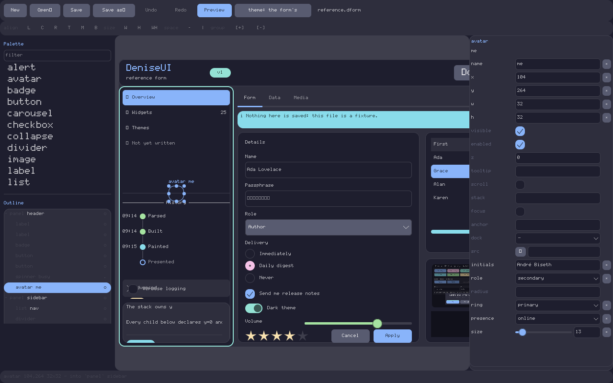
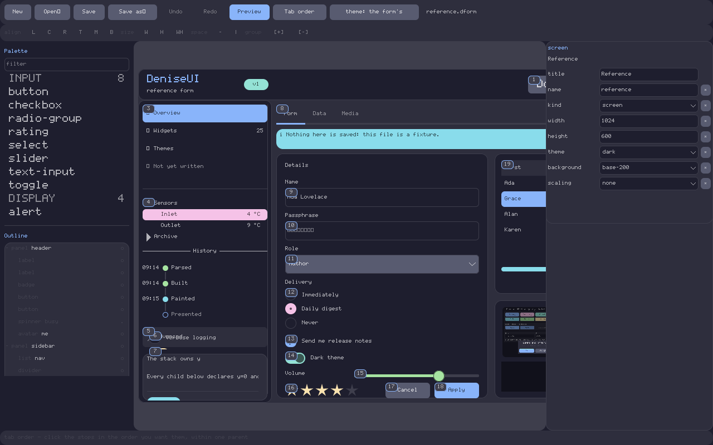
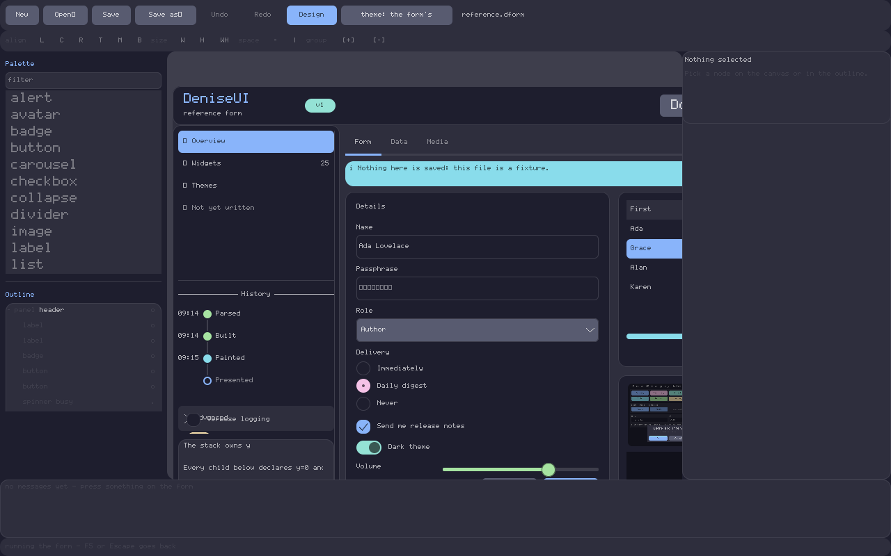
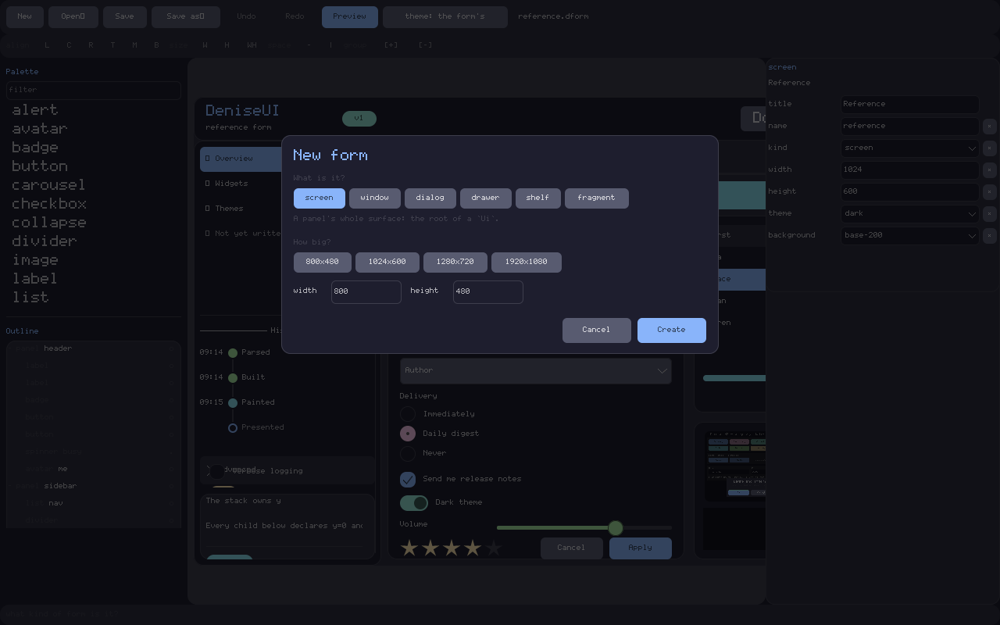

# denise-designer

A visual form designer for [DeniseUI](https://github.com/bisand/denise): the thing
Delphi had in 1995 and the WinForms designer kept.

```bash
cargo run -p denise-designer -- forms/reference.dform
```

It reads and writes [`.dform` files](../../docs/forms.md), which are text, and
which [`denise-forms`](../../denise-forms) loads on the panel.

## Getting it without a Rust toolchain

Every [release](https://github.com/bisand/denise/releases/latest) carries a
build for each platform, holding the designer, the `denise-forms` command line
tool, and the reference form to open:

| | |
|---|---|
| macOS | a `.dmg` with **Denise Designer.app**, universal for Intel and Apple silicon |
| Windows | a `.zip` with the `.exe` |
| Linux | a `.tar.gz` each for x86-64 and aarch64 |

Each has a `.sha256` beside it.

**They are not signed.** There is no Apple Developer account behind this project
and no Windows code-signing certificate, and saying so is cheaper than pretending
otherwise:

- **macOS** — right-click *Denise Designer.app* and choose **Open**, then
  **Open** again. macOS remembers, and every launch after that is a double-click.
  Double-clicking it the first time gives "cannot be opened because Apple cannot
  check it for malicious software", which is Gatekeeper working as designed.
- **Windows** — SmartScreen offers **More info**, then **Run anyway**.
- **Linux** — `tar xzf` and run it. Linux does not care.

Or build it, which is three words and needs no explanation:

```bash
cargo run -p denise-designer
```

## It is a Denise application

Not Tauri, not egui, not a web page. The canvas draws the form with **the same
code that will draw it on the panel** — the same widgets, the same rasteriser,
the same theme roles — so what is on screen is what ships, to the pixel, rather
than an approximation somebody has to keep in step.

That also makes it the first real application written on this toolkit, which is
worth more than the convenience: what the toolkit lacks turns up here first. It
already has. The pane layout is `Dock`, and building it found a case where a
reflow starting *at* a docked node computed its rectangle from its own layout
instead of from its siblings — a whole pane with the right gap beside it and
nothing in it.

## The canvas is not a second `Ui`

The form is built into a subtree of the designer's own tree, inside a scrolling
viewport. One tree, one event loop, one damage tracker.

What keeps the form from *behaving* while it is being designed is a **scrim**: an
invisible `Panel` with `backdrop` set, sitting over the form and above it. It
absorbs every press and leaves the focus exactly where it was — the same
affordance that lets an on-screen keyboard type into a field without the field
losing its caret. Preview mode is hiding the scrim, and that is the whole of
preview mode.


## Design mode

A press on the canvas never reaches the form. Design mode reads the events first
and does **its own hit test**, because the tree's is about what a *running* form
should react to and that is not the same question: a `Label` answers `false` to
`accepts_pointer`, so the tree would send a click straight past it — right on a
panel, where a label sitting on a button must not swallow the press, and wrong
here, where clicking a label has to select the label. A node that is not *drawn*
is skipped, so an invisible sheet over the whole form does not eat every click.

| | |
|---|---|
| Click | Selects what is under it. Shift adds and takes away. Escape clears. |
| Tab | Walks the form in file order; Shift+Tab back. |
| Drag the body | Moves. Drag a handle: resizes. Drop it on a panel: reparents. |
| Drag empty space | A rubber band. Shift keeps what was already held. |
| Arrow keys | One pixel. With Shift, twice the grid. |
| PageUp/PageDown | To the front of its siblings, or to the back — by reordering the file. |
| Ctrl/Cmd-C, X, V | Copy, cut and paste — as `.dform` source, on the system clipboard. |
| Ctrl/Cmd-D | Another one of it, beside it. |
| Delete | Takes the node and everything under it out of the file. |
| G | Turns snapping off, and on again. |
| Ctrl/Cmd-Z | Undo. With Shift: redo. |
| F5 | Runs the form, and stops running it. Escape also stops. |
| Enter | Puts down whatever the palette has armed. Escape gives it up. |
| F2 | Renames the selected node, in the outline, in place. |
| Escape | Clears the selection — which is what puts the *form's* properties in the pane. |

Snapping is to a 4-pixel grid and, in preference to it, to the edges and centres
of the node's **siblings** — the only alignment that means anything when there is
no layout engine. A guide is drawn on whatever it lined up with.

**A drag is one edit.** The tree moves while the pointer does, so it can be seen;
the file is written once, on release, as a targeted edit to that node's line. A
press that never moved writes nothing at all, because it was a selection. That is
what keeps a move to a one-line diff, and what makes it one undo step.

## The band


Press where there is nothing to take hold of, drag, and everything the rectangle
**wholly** encloses is selected — brushing a node does not take it, which is what
lets a band be drawn through a crowd to reach the two widgets at the far end.

A band belongs to **one container**, and takes only its direct children. A band
drawn across a panel from outside it would otherwise select the panel *and*
everything in it, with no way to say which was meant; starting the band inside
the panel says it plainly. So a panel is a thing before it is a surface: the
first press takes hold of it, and once it is held its background is somewhere to
band over. A band that catches nothing inside a container leaves that container
held, so banding into one is never a one-way door.

Nothing here touches the file. A selection is not an edit.

## With several selected


A strip under the toolbar: align, same size, space evenly, group and ungroup.
It is always there rather than appearing when it applies — a command nobody can
see is a command nobody knows about — and its buttons go grey one at a time,
each saying in its **tooltip** what it wants instead of what it does. The
labels are one or two characters because the font this toolkit ships is ASCII
and Latin-1, and the arrows and boxes an icon would want are not in it: they
would draw as empty squares, which is worse than a letter.

Move and nudge act on everything selected — one drag, one arrow key, one undo
step, however many nodes went with it.

**Siblings only.** A rectangle in a form file is relative to its parent and
there is no layout engine, so "line these up" only has an answer when they are
measured from the same corner. Two nodes in different panels have no shared
space to be aligned in: the numbers would have to be translated through both
parents, and the answer would stop being true the moment either panel moved. So
the commands go grey rather than doing something that looks right once.

**The anchor is the one wearing the handles** — the primary selection, the last
one taken. [The issue](https://github.com/bisand/denise/issues/95) asked for the
*first* selected, the way Delphi did, but a rubber band has no first-clicked
node to point at: it takes what it encloses in file order, and neither end of
that list means anything to the person who drew it. The one wearing the handles
is the one that can be seen, and it is what the inspector, the name tag and the
outline already mean by "selected".

Everything here is settled after one go: giving the same command twice is the
same as giving it once, because the anchor never moves.

**Group** puts the selection inside a new panel that takes their bounding box,
with every rectangle translated so that nothing appears to move; **ungroup** is
the reverse, and takes the panel away with it. Both are one step to undo, and
both go through the same `Edit::Move` as every other change of parent.

## Dropping a node onto a panel



Let a node go over a panel and it becomes that panel's child, **with its
rectangle rewritten so that it does not appear to move**. Drag it back out over
the form and the reverse. The container that would take it is outlined while the
drag is in flight and named in the status line, so a reparent is never a
surprise.

Dropping on something that cannot hold children targets whatever holds *it* — a
button dropped on a button inside a panel lands in the panel. What can hold
children is `denise_forms::owns_children` and not a list here, so a `collapse`
takes a drop and a `select`, which holds options rather than widgets, does not. A
node cannot be dropped into itself: the subtree being dragged is looked straight
through.

This is the same `Edit::Move` the outline's drag uses, which is why the two
panes agree about what reparenting means rather than agreeing by care. Because
the rectangle in a form file is relative to the parent, keeping a node still on
the screen means giving it different numbers — so a reparent is two edits applied
as one, and undone as one.

## The clipboard carries source

Copy puts the selected nodes on the system clipboard as **`.dform` text**, not a
private encoding. That is Delphi's trick and it is worth stealing: paste into a
text editor and you have the source, paste from a text editor and you have the
nodes, and copying between two running designers is free because there was never
a second format to agree on.

```
panel name=left x=4 y=30 w=120 h=120 {
    label "in-left" name=inside x=4 y=4 w=80 h=20
}
```

That is what a copied panel looks like on the clipboard — its children with it,
and a comment written above it too, because a node's leading trivia is part of
the node.

Paste lands **inside the selected container**, or beside the selected node, or
on the form, offset by twice the grid so the copy is not hidden exactly behind
what it came from. Every `name=` in the arriving subtree that the form already
uses gets a number until it does not clash — `card` becomes `card2`, and `nav2`
becomes `nav3` rather than `nav22`. `Ctrl/Cmd-D` duplicates in place, beside and
never inside: duplicating a panel means wanting a second one, not one nested in
the first. Cut is copy and delete, in one step.

**Text that is not form source is reported rather than ignored.** The schema
lives with the builder — which widgets exist, which properties each has — so the
only honest way to ask is to build it: the fragment goes into a tree nobody will
ever draw, and the answer comes back with the line the trouble is on. Nothing is
written to the file until it has built once.

The clipboard is `arboard`, in this tool and never in a library crate: a
`no_std` widget library has no business knowing what a desktop is. A test run
never reaches for the machine's own — a `cargo test` that clobbered whatever you
had copied would be a rude test suite.

## Front and back

`PageUp` puts the selected node in front of its siblings and `PageDown` puts it
behind them — **by moving it in the file**, not by writing `z=`. Siblings are
drawn in file order, so the order in the file is the order on the screen, and
somebody reading the file sees the stacking without holding a second rule in
their head. A `z=` written here would be that second rule.

Siblings only: file order decides between two children of the same parent and
nothing else, so there is no bringing a node in front of its uncle. And on a form
that *does* set `z`, `z` is what decides — the status line says so, rather than
leaving somebody to wonder why the file changed and the screen did not.

## Undo

There is no snapshot of anything. `Form::apply` hands back the edit that reverses
the one just made, so undo is applying that, and what *it* hands back is the redo.
The whole mechanism is two stacks of edits and a marker for where the file was
last saved — which is only possible because the thing being edited is the
document, comments and spacing included, rather than a value taken from it.

So an undo is exact. Delete a panel and undo it, and the panel comes back with
its children, its indentation, **and the comment written above it** — that
comment is part of the node, and removing the node took it too.

A drag is one step even when it moved and resized at once, and a run of nudges to
one property is one step until you work on something else. The title carries a `•`
while the file on disk is behind, and undoing back to the last save takes the mark
away again.

Closing with unsaved work stops once and says so; ask again and it goes. A modal
would be the better question and needs a second window — this is the honest
version until then, and it is at least impossible to lose a form to one keystroke.

## The other editor

The point of a text format is that a text editor is the other half of it, so both
are open on the same file and either may write it. Both halves of that courtesy
are here.

**Saving writes a temporary file and renames it**, so the editor watching this one
never reads a form that is halfway written.

**The file is read again when something else writes it**, within about half a
second. With nothing unsaved that happens silently — the designer was showing the
file, the file changed, so it shows the new one — and the selection comes back
**by the name the file gave it**, which survives the other editor having inserted
a node above it. So does what is folded, and what the eye has hidden. Nudge a
rectangle in Vim and watch it move on the canvas with the right thing still
selected.

With unsaved work there is one question, and it gets asked rather than answered by
whoever wrote last:


The list is real — it is the two versions compared node by node, named nodes
matched by name and the rest by position, so realigned columns and a new comment
are not changes. **Reload** takes the file and drops what was unsaved. **Keep
mine** changes nothing now and overwrites the file on the next save; Escape means
the same, because the safe answer to a question somebody waved away is the one
that loses nothing. Either way the file is never written without being asked
about first.

Nothing is read mid-gesture: a drag is holding nodes from the tree it started in,
and the file will still have changed when the pointer comes up.

This polls rather than subscribing to the platform's file notifications, and that
is deliberate. A change has to reach the designer *through its event loop*, which
sleeps until a frame is due — so the loop has to ask on a cadence whatever the
mechanism, and a dependency on three platforms' notification APIs would not
shorten that cadence by a millisecond. Asking also works on the network
filesystems where those quietly do not.

It **reads the file** rather than trusting its timestamp, which is the second
half of the same argument. Comparing a timestamp and a length first is the
obvious optimisation and it is wrong: the Windows clock ticks about every 16 ms,
so a write landing in the same tick as the previous one carries the same
timestamp, and a change that happens not to alter the file's length is then
invisible. A watcher that misses an edit is worse than no watcher, because it is
trusted. Reading a form file measures at 29 µs — 0.007% of a second at this
cadence — so there was nothing worth the risk.

## Tab order

Delphi had this and WinForms kept it. **Tab order** numbers every place Tab can
land, on the canvas, in the order it will land there.



The numbers come from the tree's own `Ui::tab_stops`, which is the list Tab
itself walks — so what is drawn is the order the form will really have, including
the parts this crate has no opinion about: a `label` is not a stop, nor is
anything `enabled=#false`, nor a button with `no-focus=#true`.

**Click the stops in the order you want.** Each click puts that node after the
one before it, by moving it in the file — the same one-line edit *bring to front*
writes. Nothing on the canvas moves, because every rectangle is its own; this is
a reordering and not a relayout. It is one undo.

**Only within one parent**, and that falls out of the format rather than being a
shortcut: [tab order is file order](../../docs/forms.md#tab-order-is-file-order)
read depth first, and a file can only say that one node comes before another
*inside one parent*. Moving a field from one panel into the sequence inside
another would mean moving it into that panel — a change to the design, not to the
order. Clicking across a parent starts a new run there, and the status line says
which.

There is no `tab-index`, and there is not going to be one. The file already has
an order, a person chose it, and saving keeps it.

## Preview

**F5** runs the form. Escape or F5 again goes back to designing it.



The whole of the first half is **hiding the scrim** — the invisible sheet that has
been absorbing every press over the form — and design mode giving up the canvas's
events. The same tree, the same widgets, the same paint. What changes is who the
events belong to: buttons press, fields type, a select opens.

The two columns go grey, because they are not the form's. A palette that looked
live and was not would be worse than one that says so.

The strip along the bottom lists the messages the form has fired, **by name**:
press the Greet button and `greet` appears. That is how you find out whether
`on-press=greet` is wired up without writing the application first, and it needed
a small piece of machinery — a widget carrying a value holds a `fn(bool) -> M`,
which cannot capture *which* name it belongs to, so there is a table of function
pointers, one per name, and the engine is handed the one for the name it just
resolved.

Going back rebuilds the form from the file, and that is the whole of the reset:
what was typed and what was toggled are gone, because **the file is the state** and
there was never a snapshot of anything else.

The on-screen keyboard comes up for a field and goes when the focus leaves —
which is worth watching on the form being designed, because it is the thing that
moves the form. The status line says how much of the surface it is covering.

The theme control walks the form's own, dark, light and high contrast. It
recolours **the whole window**, not only the canvas, because there is one tree and
one theme — the same reason the canvas is pixel-exact about what the panel will
draw. Going back to designing puts the designer's own theme back.

Both of the simulations #99 listed as missing are now here. **Font** waited on
[#130], which made `FontId::DEFAULT` a redirection so a form could be drawn in
something other than the built-in 5×7. **Scaled down to fit, with the scale
shown** is the zoom control below, which arrived with [#154].

[#130]: https://github.com/bisand/denise/issues/130
[#154]: https://github.com/bisand/denise/issues/154

## The palette

Every widget the toolkit ships, from `widgets::all()` — this crate names none of
them, so a twenty-sixth appears without it changing, on the right shelf and with
its own description, still without this crate changing.

**Six shelves**: input, display, indicator, container, data, media. Each widget
declares which one it is on, the same way it declares its properties. The
heading carries a count and the shelf disappears when the filter empties it.

**Resting on a row says what the widget is** — one line, declared by the widget
itself. Twenty-five bare names tell somebody who already knows which widget they
want; this is for everybody else.


**The filter reads what a widget is, not only what it is called.** Typing
`dropdown` finds `select`; typing `switch` finds `toggle`. Neither word is a
widget's name, and neither search would have found anything before.

Two ways to put one on the form, and they share their machinery:

- **Drag** a row onto the canvas. A ghost follows the pointer the whole way,
  across from one pane to the other, and the widget lands where it is let go of
  at whatever size it usually starts at.
- **Click** a row, then **drag a rectangle** on the canvas, the WinForms way — or
  press **Enter** and one goes down without drawing anything, stepping clear of
  whatever is already there so the second does not hide under the first.


Either way it is **parented to whatever container it was dropped in** — which is a
`panel` or a `collapse`, because those are the two that lay children out. A
`select` holds options and a `table` holds columns; dropping a button on one of
those has missed, and it goes on the form instead. The rectangle written to the
file is relative to the parent, which is the only space a form file knows.

What lands is the least the file can say: a rectangle, and for five widgets one
thing more, because an `alert` has no colour to draw itself in without a `role`
and a `slider` has no range without `min` and `max`. That comes from
`denise_forms::seed`, which lives next to the code that raises those
requirements so the two cannot drift.

The new node is selected the moment it lands, so the inspector is already
describing it, and the whole placement is one undo.

## The outline

Every node of the form, indented, in file order — not only the ones with names.
That is what the pane is *for*: the canvas cannot show a node behind another, one
clipped out of its parent, one sized to nothing, or the ninetieth identical row of
a table, and all of those have to be reachable.

```
- panel header          o
    label               o
    badge               o
    spinner busy        .
- panel sidebar         o
    list nav            o
```

The kind, then the name. A `-` or `+` folds a subtree. The mark on the right is an
**eye**: press it and the node is hidden *in the designer only* — `x` — which is
how you reach what is sitting behind it. Nothing about that is written to the
file, and the form is not marked as modified. A node the **file** hides, with
`visible=#false`, shows a `.` instead: the eye did not do that and cannot undo it,
and the inspector's `visible` row is where it is changed.

Selection is shared with the canvas both ways: click a row and the canvas draws
handles round it; click the canvas and the row highlights.

**Drag a row** to reorder it among its siblings or to reparent it — dropping on
the middle of a `panel` or a `collapse` puts it inside, dropping on an edge puts
it beside. A marker shows which. That is one `denise_forms::Edit::Move`, so it is
one undo step, and the node is **re-indented** for its new depth, children and
all, because a file whose nesting and whose indentation disagree is one somebody
has to fix by hand.

**F2** renames the selected node in place. Enter keeps it, Escape does not.

`-` and `+` and `o` rather than triangles and an eye glyph because the built-in
5×7 font covers ASCII and Latin-1 and nothing else, and a `▾` draws the
missing-character box. Which is what every tree control drew before it had the
glyphs for anything better.

## The form itself



A form is not only a tree. It has a **kind**, and the kind is the first thing
asked, the way Delphi asked *Form / Data module / Frame*: it decides what the
rest of the questions even are. *New* puts up a sheet with all six, because
somebody choosing what to make should be able to see the choices, and what it
writes is **only what is not a default** — a form that spelled out every default
would read as a form somebody had made decisions about.

With nothing selected, the inspector shows the form's own properties. That is
the only way to reach them: the form node is not on the canvas and not in the
outline, so a pane that said *nothing selected* was a pane saying the form's
size could not be changed. The rows come from the same descriptors the widget
rows do, so **the kind changes which rows there are** — a window has
`resizable`, a dialog has `dim`, a drawer has `side` and `extent`, and a screen
has none of them. Writing one on the wrong kind is refused with the same error a
typo gets.

**The canvas shows the kind.** A dialog is drawn at the size it will have, on a
backdrop; a drawer and a shelf are drawn attached to their edge of the screen
they come in over, at exactly the rectangle `Ui::push_drawer` will give them —
`width` and `height` are that screen and `extent` is how far it comes in. A
screen, a window and a fragment are the whole surface and get no backdrop.

The dimmed backdrop behind a dialog is a stand-in and knowingly so: the toolkit
dims a scene with black at an alpha, and a `Panel` names a theme *role* rather
than a colour, so there is no role that means "whatever is behind, darker". What
the canvas draws is that there **is** a backdrop and where the dialog sits on
it; `dim` in the inspector is what says how dark it will really be.

## The inspector

Select something and its properties fill the right pane, each with an editor
chosen from its type: a field for a string, a box for a flag, a dropdown for a
role, a field with a slider beside it for a number over a range you can aim at.

**Nothing in the designer lists them.** A row exists because the widget's own
`Describe` implementation says the property exists, and the properties the *tree*
owns — `x`, `visible`, `dock` — come from `denise_forms::NODE_PROPERTIES`,
described the same way. A twenty-sixth widget, or a twenty-seventh property on an
existing one, gets its editors without a line of this crate changing.

Edits apply **as they are typed**, through the same `set` the engine calls when it
loads a form — so the pane cannot show a value the engine could not load, and one
the widget refuses is reported in the error role rather than written. An `x` of
`over there` never reaches the file.

A property the file does not write is at its default, and is dimmed to say so. The
`×` beside one it does write takes it back out, which is what returning to a
default means when the schema does not spell defaults out. Clearing a field does
the same thing.

Where the file already writes a property as the node's **argument** — `label
"Heading"`, which is how every form here is written — that is what an edit
changes. Adding `text="…"` beside it would leave the file saying one thing and the
screen showing another.

Select several and the pane shows what they have in common, blank where they
disagree, and an edit goes to all of them as a single undo step.

Two things the pane writes but the canvas cannot immediately show: a message name,
which is a value of the *application's* type and so is not something any widget
can be handed, and a property cleared back to a default that only exists once the
widget is built again. Both are written to the file at once and the canvas catches
up when the caret leaves the field — rebuilding mid-keystroke would take the caret
out of the field being typed in.

## What is here

| | |
|---|---|
| **Palette** | Every widget the toolkit ships, from `widgets::all()` — on six shelves, each row saying what it is, filtered by name *or* description, dragged or clicked onto the canvas. |
| **Outline** | Every node, as a tree: folded, selected, renamed, dragged to reparent, and hidden here without the file knowing. |
| **Canvas** | The form, drawn — selected one at a time or by rubber band, moved, resized, reparented by drop, reordered front to back, copied, pasted and deleted. |
| **Inspector** | The selected node's properties, edited — from the widget's own `Describe`, so again no list here. With nothing selected: the form's own. |
| **Toolbar** | New, Open, Save, Save as, Undo, Redo, Preview, Tab order, and the theme being simulated. |
| **Arrange** | Align, same size, space evenly, group and ungroup — greyed one button at a time, each saying in its tooltip what it wants. |
| **Log** | While previewing: the messages the form has fired, by name. |
| **The file** | Watched: written by something else, it is read again — silently, or with one question when there is unsaved work. |

Open a form, save it, and `git diff` is empty: the document is what is held, not a
value taken from it, so a save that changed nothing changes nothing. That is the
round trip the whole file format is built around, and it is checked against a
corpus of forms written the way people write them — comments in every position
KDL allows one, hand-aligned columns, a property written three times, a panel
with no braces, no trailing newline. Every one of them opens and saves without a
byte moving, and nudging any node in any of them changes exactly the line that
node is written on. See [`denise-forms/tests/awkward/`](../../denise-forms/tests/awkward/README.md).

## What is not here yet

The palette's rows have no **icon**. Grouping and the tooltip came from the
widget declaring them; a glyph is a theme's business more than a widget's, and
where it should be declared is genuinely undecided. It is also the least of the
three, so it is waiting for somebody to want it rather than for a design.

The outline remembers what is folded and what is hidden **by path**, so an edit
that shifts a path leaves those pointing at whatever moved into its place. A form
is small and a click puts it right; the alternative is giving every node an
identity the file does not have. Reading the file again is the one case that does
better, because it can afford to: everything with a name is put back by name.

A message field is a field, not a combo box: the name being typed is usually one
the form has not used yet, and this toolkit has no widget that is both. What the
form *does* already use is in the row's tooltip.

## Elsewhere

`--snapshot out.ppm` draws one frame and exits, with no window — with `--select`,
`--drag`, `--carry`, `--band`, `--new`, `--hover <kind>`, `--tab-order`,
`--clash <other.dform>`, `--scale <factor>`, `--zoom <percent|fit>` and `--preview` to pose it, since a snapshot has no pointer to select, drag,
carry, band or rest on anything with, and no second editor to change the file
under it — the same
affordance every example in this repository has, and how this one's own layout
gets reviewed over SSH or diffed in a pull request.

## Four text sizes, and why those

The built-in face is a five-by-seven glyph in an eight-pixel cell drawn at
whole-number multiples, so `size_px / 8` decides everything and **every size
from 8 to 15 rendered identically**. This crate named 11, 12, 13, 14, 15 and 17;
five of those were one size on screen. Writing a different number cost nothing
and did nothing, so nobody ever had to mean one.

[#130] gave the designer a real face and the distinctions became real overnight.
The window gained a size hierarchy nobody had chosen, and the pane with the most
text in it — the inspector, at 11 — landed at the bottom of it. That is what
[#155] was reported as: *the properties box looks a bit smaller than the rest.*
It was.

Measured with Arial, the sizes **pair up**: 10 and 11 differ by one pixel across
six characters, and so do 12 and 13, 14 and 15, 16 and 17. Naming two of a pair
in one window is a distinction that cannot be seen. So the scale takes every
*other* size, and there are four:

| step | px | used for |
|---|---|---|
| `Caption` | 11 | text *about* the interface: the status line, strip captions, the log, a sheet's explanatory line |
| `Body` | 13 | everything read and edited — property names and editors, outline rows, palette rows, toolbar buttons, the filter |
| `Heading` | 15 | a pane's name, and the line saying what is selected |
| `Title` | 17 | a sheet's title |

Two of those moves are corrections rather than taste. The inspector was below
body text for no reason, and the palette's rows were at **16** because `List`
defaults to 16 and nobody had ever named a size — the same class of accident
[#153] found in the `List` that never scaled.

It is an `enum`, not four constants, for the reason the widgets publish
`Property` descriptors rather than this crate keeping a table of them: a number
that cannot be written cannot drift. There is no `with_size(12)` to reach for,
so a twenty-eighth label is one of the four or it does not compile.

What this does **not** settle is whether typography belongs in the theme, so
that every widget's default came from it rather than from a constant in each
one. `docs/design.md` parks that as its own design conversation and it stays
parked; this is one application choosing its own sizes, which is what the
toolkit asks an application to do.

[#153]: https://github.com/bisand/denise/pull/153
[#155]: https://github.com/bisand/denise/issues/155

## The display's scale, and the canvas's own

The chrome is written in logical units and multiplied once, on the way into the
tree: `Theme::scaled` for the widgets' furniture, `Rect::scaled` for every
rectangle, and a scaled size wherever text names one. That is the pattern
`docs/design.md` settles on, and the designer is the application it was written
against — it took the factor from `run_with` and dropped it, so from its first
commit every pane, row and label came out at **half** the size it was drawn at
on a 2x display. Correct on a Pi, which is why nothing caught it: the whole test
suite runs at 1x, where a rectangle that was never scaled looks exactly like one
that was.

So it is checked at 2x instead, against arithmetic rather than a blessed
picture — every node of the chrome, and the text size of every node that has
one, has to be exactly twice what it is at 1x. `--scale <factor>` is the same
lever for a snapshot, and grows the surface with it, the way a real window does.

**The canvas follows the display too, and 100% means actual size on this
screen.** It did not at first: a form is authored in a panel's own device
pixels, so the canvas was left at one screen pixel per form pixel whatever the
display's density. That is faithful to a kiosk and wrong to look at — on a 2x
display the form came out at half the size of the toolbar beside it, and the
first person to open it reported it as a bug. It is one: nobody eyeballing a
canvas is counting device pixels, and `denise-forms render --scale` is where a
pixel-exact check belongs.

So the canvas transform is the display's scale *and* the zoom control together,
and `Zoom` carries both — `percent` is the user's and `device` is the screen's,
with `factor()` the product. `percent()` is still the user's hundred per cent; `is_unit()`
is the narrower question a conversion asks, and is true only on a 1x display at
100%. Fitting is the one place the two must not be confused: it
measures the window in screen pixels and answers in the user's percentage, so it
divides the display's scale back out and `set_zoom` puts it back on.

The zoom control is still a separate choice on top — the toolbar says what it is
at, `+`, `-` and `0` step it, and `9` fits the whole form in the window.

### The numbers never change

That is the whole rule, and everything below follows from it. `width 800` in the
inspector means 800 at 25% and at 400%; a drag of one form pixel writes one form
pixel; the grid snaps to the grid the *file* records, so the same gesture settles
on the same numbers at every magnification. Zoom changes what a form pixel looks
like and nothing else.

It is one conversion, stated once and used in both directions. `Form::build_scaled`
puts the whole form subtree in screen units, which is what lets the tree's own
hit testing, painting and handle placement carry on knowing nothing about any of
this. What needs converting is every number crossing to or from the **file**:
a drag committing, a widget dropped, a reparent, and the four rectangle rows in
the inspector going each way.

Below 100% a form pixel is less than a screen pixel and the round trip stops
being free — `in_form(on_screen(11))` is 12 at 50%. So a drag keeps its own form
rectangle as the thing it is really editing and hands the tree a copy, rather
than reading back what it just wrote. Nothing drifts because somebody zoomed out
and nudged something else.

Rectangles are not the only numbers that cross. `Form::build_scaled` multiplies
every property *measured in pixels* into the widget — that is how a magnified
form gets thicker borders and larger text rather than the same ones in a bigger
box — so a spinner whose file says `thickness=3` really is holding 12 at 400%.
The inspector divides them back out, and for a length the file actually writes
it reads the **file** instead: the builder's rounding is not reversible, and 3
at 50% is held as 2, which divides back out as 4. The file still has the 3.
Typing into such a row goes the other way, so the live preview stays right until
the next rebuild. `Property::in_pixels` is what says which properties these are,
and no code here has a list of them.

The one thing over the canvas that does **not** scale with the form is the grab
handles: they are aimed at by a hand, and a hand does not get smaller when the
form does. They are the display's size at every magnification, and `Grip::at` is
given the same reach, so what can be pressed is what can be seen.

The designer draws itself in **whatever face the machine has** — a regular
upright sans, found by walking the places systems keep fonts — because it is a
desktop tool and should look like the desktop it is on. On a board with none
installed it finds nothing and the built-in 5x7 bitmap stays, which is the right
answer there rather than a fallback to apologise for. `--font <path.ttf>` names
one instead.

A `--snapshot` keeps the built-in face unless `--font` says otherwise. A
snapshot's whole value is being comparable — between two runs, between two
machines, between the two sides of a pull request — and a face picked up from
whatever happens to be installed is none of those. Every screenshot in this file
was drawn that way.

The window size and the pane widths are remembered in the platform's own
configuration directory, as four `key = value` lines.
